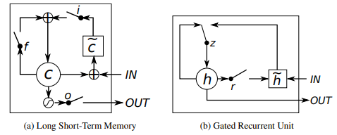

# Sequence-models-on-sentiment-classificaton

## 1. Deep Averaging network
<ul>
  <li> The aim is to study the use of different pre-trained word embeddings (word2vec/GloVe/fastText) for text representation and use them for text classification.
  <li>  Sentences are tokenized and vectorized. Averaged word vector representations of all the words in the sentence represent a sentence.
  <li>  References : Iyyer et al, Deep Unordered Composition Rivals Syntactic Methods for Text Classification.  https://people.cs.umass.edu/~miyyer/pubs/2015_acl_dan.pdf
</ul>

## 2. Recurrent Units (RNN, LSTM, GRU)
<ul>
  <li>Extensions of Recurrent Neural Network Language Model
  <li>Learning Phrase Representations using RNN Encoder–Decoder for Statistical Machine Translation
  <li>Sequence to Sequence Learning with Neural Networks
  <li>Empirical Evaluation of Gated Recurrent Neural Networks on Sequence Modeling
</ul>
The aim is to design a binary classifier for the sentiment classification
problem (now with large sentences). Every training set example contains a movie review and the corresponding sentiment
(positive/negative). The aim is to design a deep learning model for this dataset using any/all recurrent units. 

## 3. CLDNN(CNN-LSTM_DNN) model for sentence classification
<ul>
  <li> Model Consists of 1 CNN Layer followed by 1 GRU Layer followed by fully connected layer.
  <li> Word vectors in a sentence are given as input to the CNN layer with context window of 3 word vectors. 
  <li> CNN's output is flattened out and given to GRU's input. 
  <li> GRU output is given to fully connected layer which classifies the sentence.
  <li> References : Convolutional, Long Short-Term Memory, Fully Connected Deep Neural Networks : https://static.googleusercontent.com/media/research.google.com/en//pubs/archive/43455.pdf
</ul>

## 4. Seq2Seq Models : Encoder-Decoder with Attention to translate dates
<ul>
  <li> Aim is to study the use of attention mechanism to translate human
readable dates to machine readable dates
  <li> Encoder model encodes the human readable dates, attention decides which words to give more score whie decoding. Finally, decoder provides the machine readable output.
  <li> References : NEURAL MACHINE TRANSLATION BY JOINTLY LEARNING TO ALIGN AND TRANSLATE : https://arxiv.org/pdf/1409.0473.pdf
</ul>
